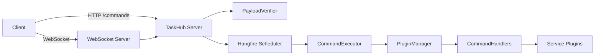

# TaskHub

Sample Hangfire-based server with plugin-based command handlers and service plugins.

## Architecture Overview

TaskHub boots an ASP.NET minimal app with Hangfire for background job scheduling, registering services such as `PluginManager`, `CommandExecutor`, and `PayloadVerifier`, then loads plugin assemblies from the `plugins` directory and maps both plugin and command endpoints.

The `/commands` API verifies an optional payload signature, enqueues or schedules command chains, cancels jobs, and returns status with executed-command history.

`PluginManager` scans the plugin folders for service and handler assemblies, instantiates them via dependency injection, and tracks loaded DLLs for later retrieval.

`CommandExecutor` resolves each command’s handler and required service plugin, executes the chain sequentially, and records results per job for status queries.

Payload signatures are optionally validated against an X509 certificate to ensure integrity.

When configured for WebSocket mode, a background service connects to a remote WebSocket server, receives serialized command requests, verifies them, and enqueues jobs via Hangfire; the companion WebSocket server maintains client connections at `/ws` and relays commands received through `/command` to matching clients.

The extension points rely on shared abstractions: `ICommand` executes against a service, `ICommandHandler` maps command names to service plugins, and `IServicePlugin` exposes a service instance.

An example `EchoCommandHandler` routes the “echo” command to the `HttpServicePlugin`, whose command implementation uses an injected `HttpClient` to fetch resources.

The system also exposes `/dlls` to list the plugin assemblies currently loaded, aiding visibility into active extensions.

### Architecture Diagram



## Building

Requires the .NET 8 SDK.

```
dotnet build
```

## Running

Build the solution and run the server:

```
dotnet run --project src/TaskHub.Server
```

The server exposes a minimal API:

- `POST /commands` – enqueue one or more commands handled by plugins. The body accepts a JSON payload with a
  `commands` array, an optional `payload` object, and an optional `signature` property. When
  `PayloadVerification:CertificatePath` is configured, the `signature` must contain a base64-encoded
  RSA signature of the `payload` verified against the configured certificate. Returns the job id with metadata.
- `GET /commands/{id}` – retrieve the status of a previously enqueued job.
- `POST /commands/{id}/cancel` – cancel a queued job.
- `GET /dlls` – list loaded plugin assemblies.

An OpenAPI/Swagger UI powered by NSwag is available at `/swagger`.

Plugins must be compiled and copied under the `plugins` directory as described in the project.
The `TaskHub.Abstractions` project contains shared interfaces and result types and can be packaged as a NuGet
dependency for plugin development.

### Job handling modes

The server handles job submissions through the HTTP API by default. Set `JobHandling:Mode` in
`appsettings.json` to `WebSocket` and provide `JobHandling:WebSocketServerUrl` to receive jobs from a remote
server over a WebSocket connection instead.

## ESLint

For JavaScript or TypeScript plugins, run ESLint to ensure code quality:

```bash
npm test
```

If no `test` script is defined, you can run ESLint directly:

```bash
npx eslint .
```


## License

This project is licensed under the [MIT License](LICENSE).
