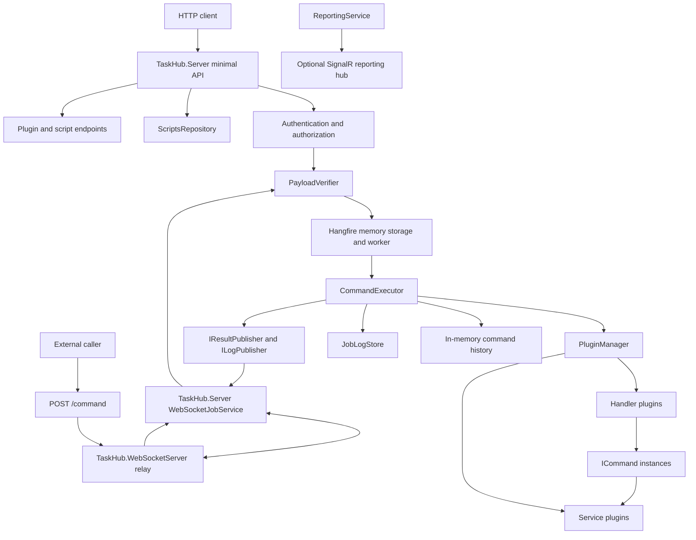
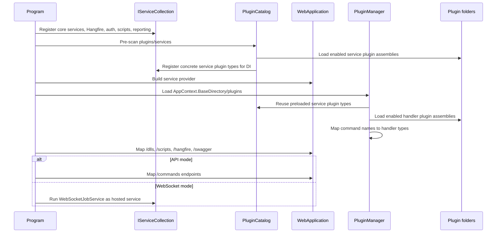
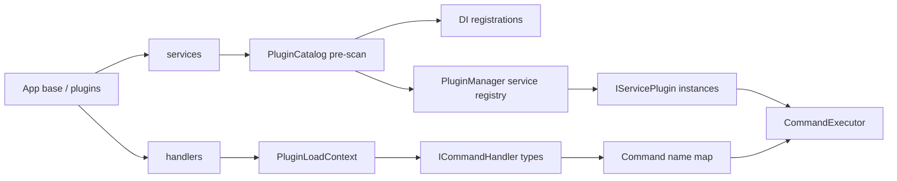
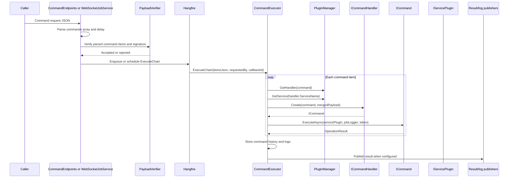
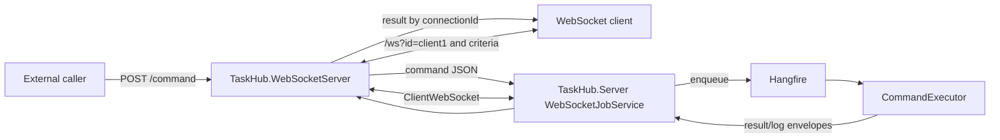
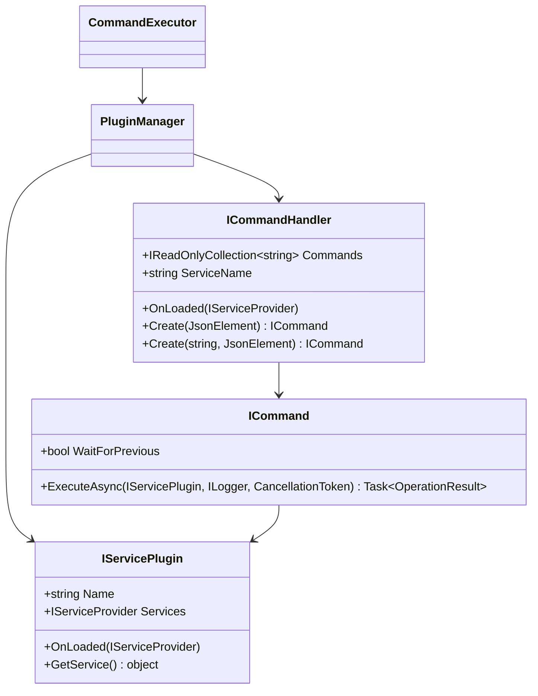

# TaskHub

TaskHub is a .NET 10 command orchestration server. It receives command requests over HTTP or a WebSocket relay, verifies the request when payload signing is configured, schedules execution through Hangfire, and dispatches each command to dynamically loaded handler and service plugins.

## Architecture

TaskHub is split into five main parts:

- `TaskHub.Server` hosts the minimal API, authentication and authorization, Hangfire, script storage, plugin loading, command execution, and optional WebSocket job client.
- `TaskHub.Abstractions` defines the plugin contract: `IServicePlugin`, `ICommandHandler`, `ICommand`, result types, result/log publishers, reporting, and optional plugin prerequisites.
- `plugins/services/*` provide reusable services such as HTTP, filesystem, registry, BitLocker, SQL, PowerShell, Overview, and Microsoft Graph.
- `plugins/handlers/*` map command names to service plugins and create executable command objects.
- `TaskHub.WebSocketServer` is an optional relay that accepts WebSocket clients at `/ws` and pushes submitted commands from `/command` to matching clients.

### Runtime Components


```mermaid
flowchart TB
    client[HTTP client] --> api[TaskHub.Server minimal API]
    relayClient[TaskHub.Server WebSocketJobService] <--> relay[TaskHub.WebSocketServer relay]
    operator[External caller] --> relayCommand[POST /command]
    relayCommand --> relay
    relay --> relayClient

    api --> auth[Authentication and authorization]
    auth --> verifier[PayloadVerifier]
    relayClient --> verifier

    verifier --> hangfire[Hangfire memory storage and worker]
    api --> scripts[ScriptsRepository]
    api --> pluginsApi[Plugin and script endpoints]

    hangfire --> executor[CommandExecutor]
    executor --> manager[PluginManager]
    manager --> handlers[Handler plugins]
    manager --> services[Service plugins]
    handlers --> commands[ICommand instances]
    commands --> services

    executor --> history[In-memory command history]
    executor --> logs[JobLogStore]
    executor --> publishers[IResultPublisher and ILogPublisher]
    publishers --> relayClient

    reporting[ReportingService] --> signalr[Optional SignalR reporting hub]
```

### Startup And Plugin Loading

At startup, `Program.cs` registers the core services, configures Hangfire with in-memory storage, sets up smart authentication, configures authorization policies, pre-scans service plugins, builds the app, then loads plugins and maps endpoints.


```mermaid
sequenceDiagram
    participant Program
    participant Services as IServiceCollection
    participant Catalog as PluginCatalog
    participant App as WebApplication
    participant Manager as PluginManager
    participant Plugins as Plugin folders

    Program->>Services: Register core services, Hangfire, auth, scripts, reporting
    Program->>Catalog: Pre-scan plugins/services
    Catalog->>Plugins: Load enabled service plugin assemblies
    Catalog->>Services: Register concrete service plugin types for DI
    Program->>App: Build service provider
    Program->>Manager: Load AppContext.BaseDirectory/plugins
    Manager->>Catalog: Reuse preloaded service plugin types
    Manager->>Plugins: Load enabled handler plugin assemblies
    Manager->>Manager: Map command names to handler types
    Program->>App: Map /dlls, /scripts, /hangfire, /swagger
    alt API mode
        Program->>App: Map /commands endpoints
    else WebSocket mode
        Program->>Services: Run WebSocketJobService as hosted service
    end
```

Plugin loading is configuration driven:

- If `PluginSettings:LoadAll` is `true`, all plugins under `plugins/services` and `plugins/handlers` are candidates.
- Otherwise, a plugin is enabled when `PluginSettings:<PluginName>` exists. The name is the folder name with `ServicePlugin` or `Handler` removed.
- If a plugin folder contains version-named subdirectories such as `1.2.0`, the highest version is loaded. If no version folder exists, the plugin folder itself is used.
- `IPluginPrerequisites.ShouldLoad` can reject a plugin after activation.
- `PluginLoadContext` isolates plugin dependencies while preferring shared assemblies such as `TaskHub.Abstractions`, `Microsoft.Extensions.*`, `Hangfire`, and `System.*` from the default load context so interface identity and DI keep working.


```mermaid
flowchart LR
    root[App base / plugins] --> servicesRoot[services]
    root --> handlersRoot[handlers]

    servicesRoot --> catalog[PluginCatalog pre-scan]
    catalog --> di[DI registrations]
    catalog --> managerServices[PluginManager service registry]

    handlersRoot --> loadContext[PluginLoadContext]
    loadContext --> handlerTypes[ICommandHandler types]
    handlerTypes --> commandMap[Command name map]

    managerServices --> serviceInstances[IServicePlugin instances]
    commandMap --> executor[CommandExecutor]
    serviceInstances --> executor
```

### Command Execution

`POST /commands`, `POST /commands/recurring`, and `PUT /commands/{id}` parse a command chain, verify the optional signature, and enqueue or schedule a Hangfire job. In WebSocket mode, the same parsing and verification happens inside `WebSocketJobService`; the local `/commands` endpoints are not mapped.


```mermaid
sequenceDiagram
    participant Caller
    participant Endpoint as CommandEndpoints or WebSocketJobService
    participant Verifier as PayloadVerifier
    participant Hangfire
    participant Executor as CommandExecutor
    participant Manager as PluginManager
    participant Handler as ICommandHandler
    participant Command as ICommand
    participant Service as IServicePlugin
    participant Publishers as Result/log publishers

    Caller->>Endpoint: Command request JSON
    Endpoint->>Endpoint: Parse commands array and delay
    Endpoint->>Verifier: Verify parsed command items and signature
    Verifier-->>Endpoint: Accepted or rejected
    Endpoint->>Hangfire: Enqueue or schedule ExecuteChain
    Hangfire->>Executor: ExecuteChain(itemsJson, requestedBy, callbackId)
    loop Each command item
        Executor->>Manager: GetHandler(command)
        Executor->>Manager: GetService(handler.ServiceName)
        Executor->>Handler: Create(command, mergedPayload)
        Handler-->>Executor: ICommand
        Executor->>Command: ExecuteAsync(servicePlugin, jobLogger, token)
        Command-->>Executor: OperationResult
    end
    Executor->>Executor: Store command history and logs
    Executor->>Publishers: Publish result when configured
```

Command request shape:

```json
{
  "commands": [
    "echo",
    {
      "command": "fake-rest-list-books",
      "payload": { "limit": 10 }
    }
  ],
  "payload": {},
  "delay": "00:01:00",
  "callbackConnectionId": "optional-websocket-client-id",
  "signature": "optional-base64-rsa-signature"
}
```

Notes:

- `commands` can contain strings that use the shared `payload`, or objects with per-command `payload`.
- `delay` can be a `TimeSpan` string or a number of milliseconds.
- `signature` is verified over the parsed command-item array. If no certificate is configured and verification is not required, unsigned requests are accepted.
- Each command payload receives `previousOutput` and `previousResult`. Commands can set `ICommand.WaitForPrevious` to force all earlier running commands to finish before the command starts.
- Successful command output and handler version are stored in in-memory history for `/commands/{id}`.

### WebSocket Mode

Set `JobHandling:Mode` to `WebSocket` and configure `JobHandling:WebSocketServerUrl` to make `TaskHub.Server` connect to a relay instead of exposing local command submission endpoints.


```mermaid
flowchart LR
    caller[External caller] -->|POST /command| relay[TaskHub.WebSocketServer]
    browser[WebSocket client] <-->|/ws?id=client1 and criteria| relay
    server[TaskHub.Server WebSocketJobService] <-->|ClientWebSocket| relay
    relay -->|command JSON| server
    server -->|enqueue| hangfire[Hangfire]
    hangfire --> executor[CommandExecutor]
    executor -->|result/log envelopes| server
    server --> relay
    relay -->|result by connectionId| browser
```

The relay can target a specific `connectionId`, or it can filter connected clients by query-string criteria supplied when they connected to `/ws`. If `WebSocketServer:ApiKey` is configured, both `/ws` and `/command` require either `X-Api-Key` or a bearer token with that value.

### Scripts And Reporting

PowerShell scripts are stored in `data/scripts.json` through `/scripts` endpoints. Script writes require the `ScriptAdmin` policy; script reads require `ScriptExecutor`. A stored script can be referenced by the `powershell-script` command using `scriptId`; `CommandExecutor` resolves the stored content before the command runs.

`ReportingService` drains reports from `IReportingContainer` and sends them to `Reporting:HubUrl` through SignalR when configured.

## HTTP Endpoints

- `GET /swagger` - OpenAPI UI.
- `GET /hangfire` - Hangfire dashboard protected by the `CommandExecutor` policy and optional basic auth.
- `GET /dlls` - loaded plugin assembly paths.
- `GET /commands/available` - loaded command metadata.
- `POST /commands` - enqueue or schedule a command chain.
- `POST /commands/recurring` - create a delayed recurring Hangfire job registration.
- `PUT /commands/{id}` - delete an existing job and schedule a replacement.
- `POST /commands/{id}/cancel` - delete a queued or scheduled job.
- `GET /commands/{id}` - job state plus in-memory executed command history.
- `GET /commands/{id}/logs` - logs captured for a job.
- `GET /scripts`, `GET /scripts/{id}` - script reads.
- `POST /scripts`, `PUT /scripts/{id}`, `DELETE /scripts/{id}` - script administration.

Command and plugin endpoints require the `CommandExecutor` policy. Script endpoints use `ScriptExecutor` and `ScriptAdmin`. Authentication uses a policy scheme that selects bearer-token auth when the `Authorization` header starts with `Bearer `, otherwise Negotiate auth.

## Build And Run

Requires the .NET 10 SDK.

```bash
dotnet restore TaskHub.sln
dotnet build TaskHub.sln
dotnet test TaskHub.sln
```

Run the main server:

```bash
dotnet run --project src/TaskHub.Server/TaskHub.Server.csproj
```

Run the optional relay:

```bash
dotnet run --project src/TaskHub.WebSocketServer/TaskHub.WebSocketServer.csproj
```

Plugin projects write their build output under `src/plugins/services/<PluginProject>` or `src/plugins/handlers/<PluginProject>`. During server build, those outputs are copied to the server output folder under `plugins`, which is the folder `PluginManager` scans at runtime.

## Configuration

The default server configuration lives in `src/TaskHub.Server/appsettings.json`.

Common settings:

```json
{
  "PluginSettings": {
    "LoadAll": true
  },
  "JobHandling": {
    "Mode": "",
    "WebSocketServerUrl": "ws://localhost:8080/ws?id=taskhub"
  },
  "PayloadVerification": {
    "CertificatePath": "",
    "Required": false
  },
  "Hangfire": {
    "Username": "",
    "Password": ""
  },
  "Reporting": {
    "HubUrl": "",
    "IntervalSeconds": 30
  }
}
```

Authorization policies are configured under `Authorization:Policies`. SID-to-role mapping is configured under `Authorization:SidMappings`.

## Plugin Development

A service plugin implements `IServicePlugin` and exposes a named service instance. A handler plugin implements `ICommandHandler`, declares one or more command names, declares the service plugin name it needs, and creates an `ICommand` for each request payload.


```mermaid
classDiagram
    class IServicePlugin {
        +string Name
        +IServiceProvider Services
        +OnLoaded(IServiceProvider)
        +GetService() object
    }

    class ICommandHandler {
        +IReadOnlyCollection~string~ Commands
        +string ServiceName
        +OnLoaded(IServiceProvider)
        +Create(JsonElement) ICommand
        +Create(string, JsonElement) ICommand
    }

    class ICommand {
        +bool WaitForPrevious
        +ExecuteAsync(IServicePlugin, ILogger, CancellationToken) Task~OperationResult~
    }

    class CommandExecutor
    class PluginManager

    CommandExecutor --> PluginManager
    PluginManager --> IServicePlugin
    PluginManager --> ICommandHandler
    ICommandHandler --> ICommand
    ICommand --> IServicePlugin
```

`TaskHub.Abstractions` contains the shared contracts and result DTOs used by the host and plugins.

## JavaScript Or TypeScript Plugins

For JavaScript or TypeScript plugins, run the plugin's test or lint script when one exists:

```bash
npm test
```

If no `test` script is defined, run ESLint directly:

```bash
npx eslint .
```

## License

This project is licensed under the [MIT License](LICENSE).
